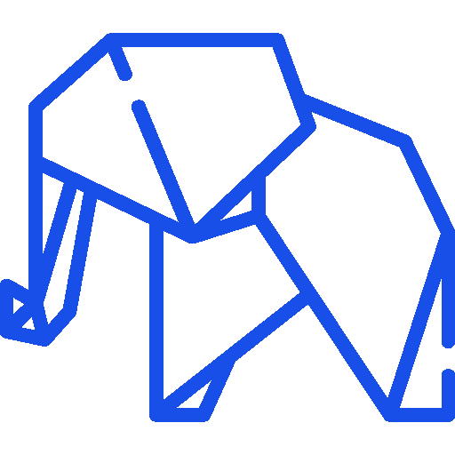
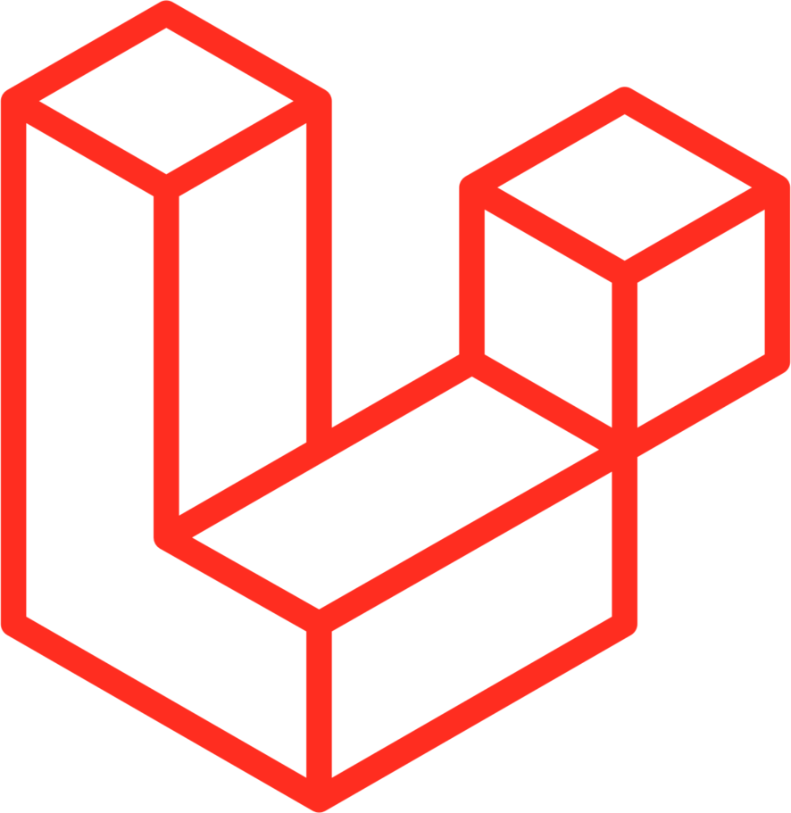
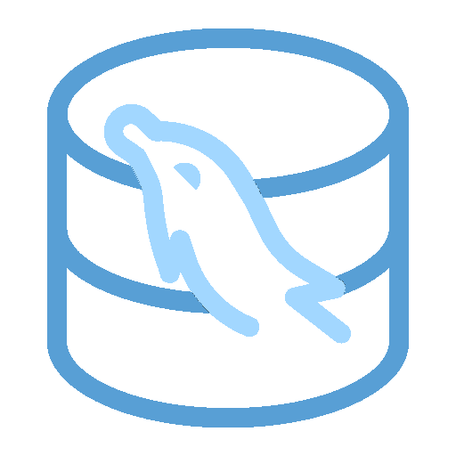
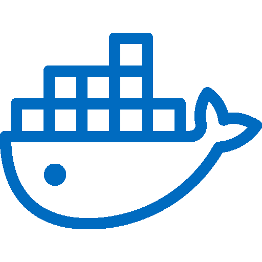
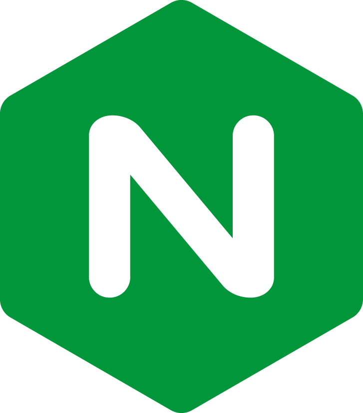
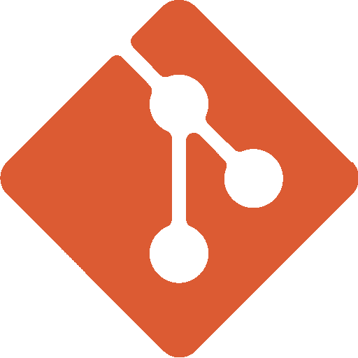
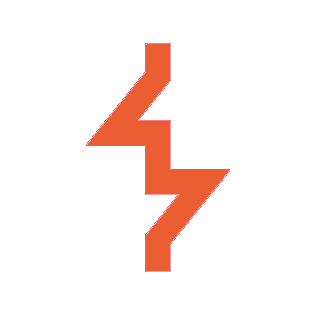
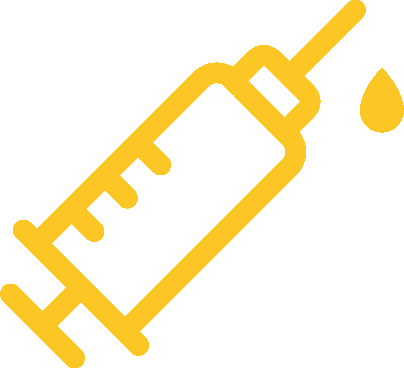
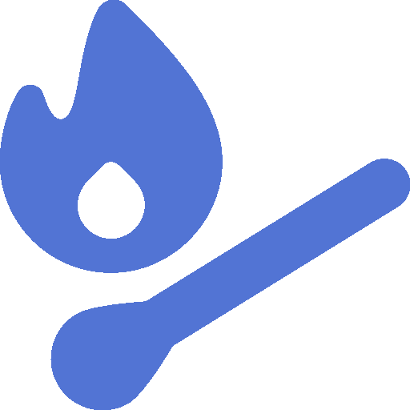
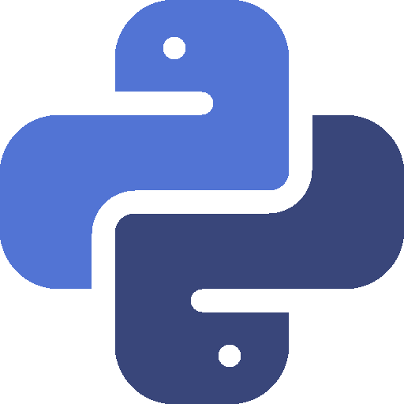

<h1 align="center"> Привет! , Я ivi</h1>
<h1 align="center">PHP/Laravel разработчик и специалист по информационной безопасности</h1>

##  Мой стек технологий:

### Разработка:

  <table>
    <tr>
      <td align="center">PHP</td>
      <td align="center">Laravel</td>
      <td align="center">MySQL</td>
      <td align="center">MongoDB</td>
      <td align="center">Docker</td>
      <td align="center">Redis</td>
      <td align="center">Nginx</td>
      <td align="center">Git</td>
      <td align="center">Bash</td>
</tr>
    <tr>
      <td align="center"></td>
      <td align="center"></td>
      <td align="center"></td>
      <td align="center"></td>
      <td align="center"></td>
      <td align="center"></td>
      <td align="center"></td>
      <td align="center"></td>
      <td align="center"></td>

    </tr>
  </table>

### Информационная безопасность:

  <table>
    <tr>
      <td align="center">Kali Linux</td>
      <td align="center">BurpSuite</td>
      <td align="center">Wireshark</td>
      <td align="center">Nmap</td>
      <td align="center">SQLMap</td>
      <td align="center">DirB</td>
      <td align="center">Wifite</td>
      <td align="center">NetCat</td>
      <td align="center">Hydra</td>
</tr>
    <tr>
      <td align="center"></td>
      <td align="center"></td>
      <td align="center"></td>
      <td align="center"></td>
      <td align="center"></td>
      <td align="center"></td>
      <td align="center"></td>
      <td align="center"></td>
      <td align="center"></td>
    </tr>
  </table>

##  Мои проекты:

###  Web:
#### 1. **[Jury-App ()](https://github.com/iiivwviii/Jury-App)** - Журийная система для CTF соревнований

###  Api: 
#### 1. **[Libry](https://github.com/iiivwviii/Libry)** - Минималистичный REST API реестр книг в библиотеке
#### 2. **[TinyStore](https://github.com/iiivwviii/TinyStore)** - Минималистичный REST API интернет-магазин

###  Python:
#### 1. **[SpamBot](https://github.com/iiivwviii/Spam_Bot_GUI)** - Бот для автоматического ввода текста
#### 2. **[SpamQ](https://github.com/iiivwviii/SpamQ)** - Макрос для нажатия клавиш Q/W

###  Bash: 
#### 1. **[AddPass](https://github.com/iiivwviii/AddPass)** - Установка пароля для приложений

